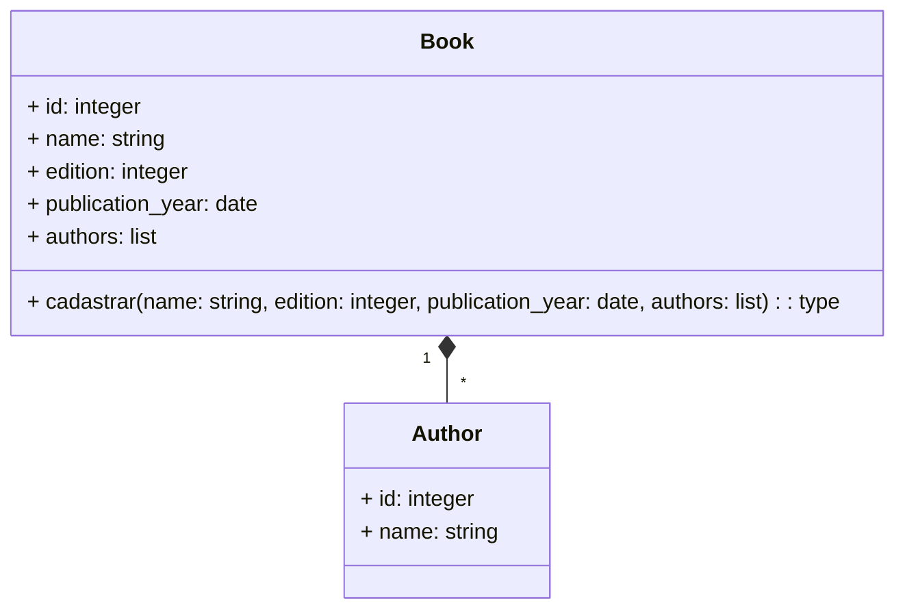

## Documentação do Projeto: Library Management System

    Desafio da empresa https://olist.com/

### Principais Tecnologias
 - **Django**
 - **Docker**
 - **Restframework (django)**

### que foi feito 
-    **Receber um arquivo CSV com autores e importá-lo para o banco de dados**
-    **Expor os dados dos autores em um endpoint**
-    **Operações de CRUD (Criar, Ler, Atualizar e Deletar) para livros**

<table>
    <tr>
        <th>/authors</th>
        <th>/books</th>
        <th>Um livro pode ter muitos authores</th>
    </tr>
    <tr>
        <td></td>
        <td></td>
        <td></td>
    </tr>
    <tr>

Link do desafio: https://github.com/olist/work-at-olist#1-receive-a-csv-with-authors-and-import-to-database
